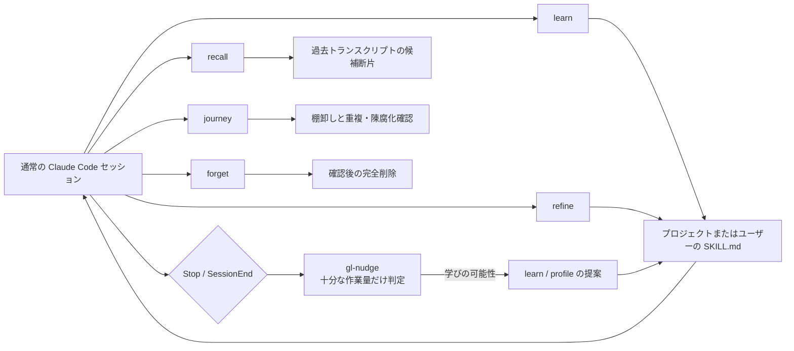
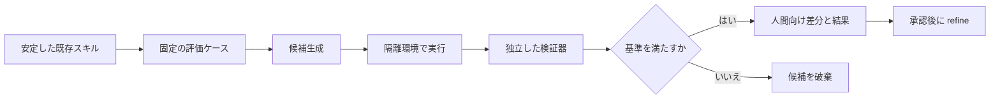

# growth-loop 競合・隣接プロジェクト調査報告

- 調査日: 2026-08-06
- 調査対象: ローカルの growth-loop 0.1.0
- 主な比較対象: SkillClaw、EvoSkill、self-improving-agent、Hermes Agent
- 調査方法: growth-loop の実装・テスト・設計記録の精査、各プロジェクトの公式リポジトリ・公式文書・論文の比較

## 要約

growth-loop の最大の強みは、Claude Code に不足する「学習、修正、想起、プロファイル、棚卸し、削除」の閉ループだけを、13ファイルの小さなプラグインとして追加している点にある。SkillClaw の集合学習、EvoSkill の評価駆動最適化、Hermes Agent の包括的なエージェント基盤とは競争する層が異なる。日常利用の邪魔をせず、学習物を人間が理解できる `SKILL.md` として保ち、蓄積だけでなく修正と削除まで同じ設計に含めたことは明確な差別化である。

一方、現状は「自己改善システム」というより「慎重な知識ライフサイクル管理プラグイン」に近い。作成したスキルが次回以降の成功率を上げたかを測る仕組み、失敗から候補を抽出して検証する中間層、検索インデックス、出典・信頼度・利用実績、同時書き込み対策、セキュリティ検査がない。改善を実際の成果に結び付ける点では EvoSkill や Hermes の自己進化系、運用観測では SkillClaw、候補管理では Gemini CLI Auto Memory や skill-extractor に先行例がある。

推奨方針は、growth-loop をフルエージェントやクラウド集合学習基盤へ拡張しないことである。まず書き込み前の候補箱、構造化した証拠と結果、アトミック更新、検索と安全検査、ヘッドレス会話テストを加える。評価駆動の進化は任意の別コンポーネントに分離する。この順序なら、現在の長所である小ささ、ローカル性、人間による統制を保ったまま、改善が効いたかを説明できるようになる。

## 1. 比較の前提

同じ「自己改善」という言葉でも、各対象が受け持つ範囲は異なる。

| 対象 | 主な位置付け | 改善対象 | 主な利用場面 |
|---|---|---|---|
| growth-loop | Claude Code 用ライフサイクル補完プラグイン | ユーザー固有の手順、失敗知識、作業プロファイル | 日常の対話型開発 |
| SkillClaw | エージェント横断の経験収集・共有・進化基盤 | 複数セッション、利用者、端末から得た共有スキル | チーム・組織・複数エージェント運用 |
| EvoSkill | 評価駆動のスキル・プロンプト最適化フレームワーク | ベンチマークに対するスキルとシステムプロンプト | オフライン実験、候補探索、性能比較 |
| self-improving-agent | OpenClaw 向け構造化学習ジャーナル | 学習、エラー、機能要望、再発パターン | 日常セッションからの手動蓄積と昇格 |
| Hermes Agent | 記憶・スキル・検索・実行基盤を備えるフルエージェント | エージェント自身の記憶、スキル、実行方法 | CLI、メッセージング、ゲートウェイを含む常用基盤 |

したがって、機能数だけで優劣を決めるのは適切ではない。growth-loop は Hermes Agent 全体の代替ではなく、既存の Claude Code を変えずに足りない閉ループだけを追加する設計である。EvoSkill は日々の対話を支える製品ではなく、評価器を使って候補を競わせる実験基盤である。この違いを保ったまま比較する。

「self-improving-agent」という名称には類似物が複数ある。本調査では、独立リポジトリとして公開されている [pskoett/self-improving-agent][self-improving-agent] の現行 OpenClaw 版を指す。

## 2. growth-loop の構造

growth-loop は Claude Code が元から持つスキル、フック、ユーザーメモリ、JSONL トランスクリプトを利用し、新しいエージェントランタイムを導入しない。



中核は次の六つの操作である。

| 操作 | 役割 | 主な統制 |
|---|---|---|
| `learn` | 再利用可能な手順を `SKILL.md` にする | 実作業、再発可能性、手順性を満たす場合だけ作成。上書きを拒否 |
| `refine` | 既存スキルの最小修正 | 実際の失敗証拠に限定。推測による磨き込みを拒否 |
| `recall` | 過去トランスクリプトを検索 | モデル外の決定的スクリプトで候補を抽出し、モデルは要約だけ担当 |
| `profile` | リポジトリ横断の安定した作業傾向を保存 | 反復、期間、複数リポジトリの条件。機微情報と推測を禁止 |
| `journey` | スキルとメモリを棚卸し | 削除、検証して修正、維持の三択。直接削除はしない |
| `forget` | 指定した学習物を削除 | 対象の逐語表示と確認後に完全削除 |

実装の根拠は [README](growth-loop/README.md)、各スキルの [learn](growth-loop/skills/learn/SKILL.md)、[refine](growth-loop/skills/refine/SKILL.md)、[recall](growth-loop/skills/recall/SKILL.md)、[profile](growth-loop/skills/profile/SKILL.md)、[journey](growth-loop/skills/journey/SKILL.md)、[forget](growth-loop/skills/forget/SKILL.md)、および三つのスクリプト [gl-nudge](growth-loop/bin/gl-nudge)、[gl-recall](growth-loop/bin/gl-recall)、[gl-journey](growth-loop/bin/gl-journey) にある。

## 3. 総合比較

### 3.1 機能と運用特性

| 観点 | growth-loop | SkillClaw | EvoSkill | self-improving-agent | Hermes Agent |
|---|---|---|---|---|---|
| 導入形態 | Claude Code プラグイン | API プロキシ、クライアント、任意の進化サーバー | Python 実験フレームワーク | OpenClaw スキル | フルエージェント基盤 |
| 学習の起点 | 明示操作と保守的な終了時ナッジ | セッション記録の収集と進化処理 | データセットと評価器 | 学習・エラー・要望の記録 | ターン後の背景処理、明示操作 |
| 主な成果物 | `SKILL.md`、プロファイル | 共有 `SKILL.md` とセッション成果物 | 候補ブランチ、評価結果、最良プログラム | `.learnings/*.md` と昇格先文書 | メモリ、スキル、SQLite 検索索引 |
| 改善の検証 | 作成条件と人間の判断。性能評価なし | 承認、スコア、拒否条件を構成可能 | 訓練・保留データ、検証器、候補比較 | 再発回数と複数タスクで昇格判断 | 差分承認、検索、自己進化リポジトリでは評価ゲート |
| 人間の統制 | 削除は強い確認。自動呼び出し時の追加・修正は確認なし | 公開モードで承認条件を設定可能 | 実験設定と最良候補の採用時に統制 | 手動記録・昇格が中心 | 書き込み承認を設定可能。候補の承認・拒否あり |
| 検索 | JSONL の線形正規表現検索 | 収集基盤側のセッション・成果物管理 | 実験ログと Git 履歴 | Markdown を grep する運用 | SQLite FTS5 によるセッション検索 |
| 修正 | 証拠に基づく `refine` | 進化エンジンが集約・生成 | 候補プログラムを反復探索 | 既存記録の更新と昇格 | スキルの作成、パッチ、編集 |
| 削除・回復 | 確認後に完全削除。復元機構なし | 共有ストレージの運用に依存 | Git ブランチで候補履歴を保持 | ステータス管理が中心 | アーカイブと復元を提供 |
| 複数利用者・端末 | 対象外 | 中核機能 | 実験結果の共有は可能 | 対象外 | ゲートウェイ・メッセージングを含む |
| 外部依存 | Python 標準ライブラリと Claude Code | プロキシ、モデル、ストレージ、任意サーバー | Python 3.12、`uv`、モデル、評価環境 | OpenClaw | Hermes ランタイム、各種バックエンド |
| 運用負荷 | 低い | 中から高 | 実験ごとに中から高 | 低から中 | 中 |

### 3.2 相対評価

| 評価軸 | growth-loop の位置 |
|---|---|
| 小ささと導入容易性 | 比較対象中で最も強い。Claude Code の既存機構に寄生し、常駐サービスを持たない |
| 学習物の理解可能性 | 強い。平文の `SKILL.md` と固定テンプレートで、人間が直接読める |
| 蓄積の統制 | 強い。実作業、再発性、手順性を要求し、陳腐化と削除を設計に含める |
| 改善効果の測定 | 弱い。成功率、利用回数、再発率、反実仮想比較がない |
| 自動的な候補発見 | 弱い。ナッジはあるが、証拠を構造化して候補箱に送る処理はない |
| 検索品質 | 弱い。正規表現の線形検索で、意味検索、索引、出典フィルターがない |
| セキュリティ境界 | 小さい点は有利。ただしトランスクリプト再注入、機微情報、同時書き込みへの機械的防御が不足 |
| 複数エージェント・組織学習 | 意図的に対象外。SkillClaw が大幅に先行 |
| エージェント基盤の完成度 | 比較対象外。Hermes Agent の領域 |

## 4. growth-loop の良い点

### 4.1 学習を「保存」ではなくライフサイクルとして扱う

多くの自己改善実装は、学習の抽出と追加で終わる。growth-loop は作成、修正、想起、棚卸し、削除を一組にしている。`journey` が陳腐化、重複、説明文の衝突を探し、`forget` が削除の最終確認を担う。この閉ループは、小さなシステムにしては完成度が高い。

特に `learn` が成功手順だけでなく `What goes wrong` を必須にしている点がよい。エージェントの失敗は、成功例の不足よりも「一見妥当だが誤った経路」を避けられないことで再発しやすい。負の知識を成果物の必須部分にした設計は、単なる会話要約より再利用価値が高い。

### 4.2 無制限な自動学習を避けている

`learn` は、実際の作業から得られ、別の機会にも再発し、手順として表現できることを要求する。`refine` も実際の失敗証拠がなければ変更しない。`gl-nudge` はツール呼び出し25回、編集3回などの保守的なしきい値と6時間のクールダウンを持つ。

この姿勢は、エージェントが自分の出力を根拠に新しい規則を作り、その規則を次の根拠にする自己汚染を抑える。SkillClaw や EvoSkill ほど自動化されてはいないが、評価器のない日常環境では妥当な安全側の設計である。

### 4.3 モデルに任せる処理と決定的処理を分けている

`gl-recall` はトランスクリプトの探索、日時順、件数制限、断片抽出を Python スクリプトで行い、モデルには候補の解釈だけを任せる。`gl-journey` もスキルの列挙や更新日時の確認をモデル外で行う。検索対象と件数がモデルの気分で変わらないため、検証とデバッグが容易である。

この境界は今後の拡張でも維持すべきである。索引、候補状態、証拠参照、承認状態はコードで管理し、意味の判断だけをモデルに渡す方がよい。

### 4.4 既存ランタイムを置き換えない

Hermes Agent は記憶だけでなく、CLI、ゲートウェイ、メッセージング、ツール、プロバイダー、実行バックエンドまでを提供する。SkillClaw は API プロキシと共有ストレージを運用経路に入れる。これらは高機能だが、既存環境に新しい障害点と権限境界を加える。

growth-loop は Claude Code のスキルとフックを使うだけであり、モデル API の中継、外部データベース、常駐デーモン、クラウド共有を必要としない。個人の開発環境で「今使っている Claude Code をそのまま改善したい」という目的には適合度が高い。

### 4.5 状態の置き場所が明確である

プロジェクト固有スキルとユーザー横断スキルを分け、ナッジ状態、台帳、プロファイルをプラグイン本体の外に置く。プラグイン更新やアンインストールで学習物が消えない一方、リポジトリに個人プロファイルが混入しにくい。プロジェクトスコープと個人スコープの分離は実用上重要である。

### 4.6 失敗しても本来の作業を止めにくい

終了時フックは例外時にも終了コード0で戻り、学習補助の不具合が本来のセッションを妨げない。自己改善機能は補助系であり、主要経路の可用性より優先してはならない。この失敗時の扱いは適切である。

### 4.7 実セッションで境界条件を詰めている

[現在状態の記録](docs/superpowers/CURRENT.md) には、単体テストだけでなく Claude Code の実セッションを使った経路確認、誤経路の監査、出力形式、パス解決、上書き防止などの修正履歴がある。机上の `SKILL.md` だけでは見つからない、モデルが指示をどう解釈するかという問題に向き合っている点は強い。

## 5. growth-loop の悪い点とリスク

### 5.1 改善したかどうかを測っていない

最大の欠点である。スキルを作成できても、その後に参照されたか、同種の失敗が減ったか、作業時間やツール呼び出しが減ったかは記録されない。`journey` の陳腐化判定も主にファイル更新日時に依存し、利用実績や成果を見ない。

EvoSkill は候補を保留データと検証器で比較し、Hermes の自己進化リポジトリは制約ゲートと評価を通して最良案を選ぶ。これらと比べると、growth-loop の「改善」は保存された知識の存在を意味するだけで、性能向上の証拠を意味しない。

### 5.2 自動書き込みと削除の承認が非対称である

削除は対象を逐語表示して確認する一方、モデルが判断して呼び出す `learn`、`refine`、`profile` は書き込み前の人間確認を必須にしていない。特にユーザー横断プロファイルは将来の全プロジェクトに影響するため、削除より追加時の誤りの方が長く残る場合がある。

明示的なユーザー操作は直接適用してよいが、背景ナッジやモデル主導の操作は候補箱へ置き、承認後に適用する方が統制の一貫性が高い。Hermes の pending/diff/approve/reject と Gemini CLI Auto Memory の inbox が参考になる。

### 5.3 証拠、出典、信頼度、適用結果が構造化されていない

現在の `SKILL.md` は人間には読みやすいが、次の情報を機械的に追跡できない。

- どのセッションと失敗から作られたか
- 同じ問題が何回、どのプロジェクトで起きたか
- どの既存スキルを置き換えたか
- 最後に使われた日時と結果
- 人間が確認したか
- どのモデル、ツール、環境条件で有効だったか

このため、重複検出、陳腐化、効果測定、誤学習の巻き戻しを高度化しにくい。Markdown 本体を汚さず、別の小さな JSONL 台帳で管理するのが適している。

### 5.4 想起が線形かつ字面依存である

`gl-recall` は標準ライブラリだけで動き、挙動が分かりやすい反面、セッションが増えるほど全ファイル走査が重くなる。表記揺れ、同義語、概念的に近い失敗を拾えない。件数制限で古い重要事例が落ちる可能性もある。

Hermes Agent の SQLite FTS5 は、外部サービスなしで増分索引と全文検索を実現している。growth-loop も Python 標準の `sqlite3` と FTS5 が利用可能なら、現在のローカル性を損なわず改善できる。ベクトルデータベースを中核依存にする必要はない。

### 5.5 トランスクリプト再注入の安全対策が弱い

`gl-recall` が返す断片には、過去のユーザー入力、ツール結果、外部コンテンツが含まれる。そこに命令文、秘密情報、長いログが含まれていても、現在は長さの切り詰めが中心で、機微情報の検査、命令とデータの境界表示、出典ごとの信頼区分がない。

これは直ちに脆弱性があるという断定ではないが、過去の低信頼コンテンツを現在のモデル文脈へ戻す経路として扱う必要がある。Hermes の memory injection security scan、skill-extractor の risk lint、Gemini CLI Auto Memory の編集禁止領域と候補レビューが参考になる。

### 5.6 同時実行とクラッシュ整合性が弱い

ナッジ状態、台帳、プロファイル、スキルは平文ファイルへ書き込まれるが、ロック、テンポラリファイルからのアトミック置換、世代番号、競合検出がない。複数の Claude Code セッションが同時終了した場合や、書き込み途中でプロセスが止まった場合に、重複、欠落、部分書き込みが起こり得る。

単一ユーザー環境でも端末やワークツリーを複数開くことは一般的である。規模を増やす前に直すべき基礎的な問題である。

### 5.7 完全削除に復元経路がない

`forget` は削除対象を厳密に確認する点では安全だが、削除後のアーカイブや取り消しがない。Hermes Agent はアーカイブと復元を提供し、EvoSkill は Git ブランチで候補履歴を保持する。

個人情報や明示的な忘却要求では完全削除が必要である。一方、品質上の理由で一時的に無効化したいだけなら、アーカイブの方が適する。`archive` と `purge` を分離すべきである。

### 5.8 指示文の契約が機械化されていない

これまでの監査では、ある指示を足した修正が別の経路を壊し、`SKILL.md` が膨張する傾向が記録されている。テストも肯定的な文字列包含に偏り、誤経路を防ぐ否定テストが相対的に少ない。

モデル向け指示は通常の関数ほど決定的ではない。経路、必要証拠、禁止操作、出力形式を機械可読な契約として分離し、会話トランスクリプトの差分テストを追加しなければ、文面の追加だけで品質を保つのは難しい。

### 5.9 配布物として未完成な箇所がある

README のクローン例には `<repo>` のプレースホルダーが残り、リポジトリ直下に実体の `LICENSE` ファイルが見当たらない。マニフェストの MIT 表記だけでは、第三者が再配布・導入する際の確認材料として不十分である。GitHub 公開、タグ、変更履歴、インストール確認の自動化もまだない。

### 5.10 長期実運用の証拠がまだ少ない

実セッション試験は豊富だが、1か月単位で「何が学習され、何回再利用され、何件が誤学習・重複・陳腐化したか」という運用データはまだない。追加機能を急ぐより、現在のループを一定期間使い、どこで人間が面倒に感じるかを測る価値が高い。

## 6. 個別比較

### 6.1 SkillClaw

[SkillClaw][skillclaw] は、OpenAI 互換や Anthropic 互換の API 経路にプロキシを置き、会話、ツール呼び出し、成果物をセッション単位で収集する。任意の進化サーバーが、ワークフロー型の Summarize → Aggregate → Execute、または OpenClaw ベースのエンジンで経験を共有スキルへ変換する。ローカル、Alibaba OSS、S3 系の共有ストレージを選べ、Hermes、Codex、Claude Code、OpenClaw など複数クライアントを対象にする。公開モードでは結果、承認、スコア、拒否条件を設定できる。

[SkillClaw 論文][skillclaw-paper] は、複数利用者の軌跡集約と WildClawBench での改善を報告している。ただし、これは著者による評価であり、growth-loop 上での再現試験は行っていない。

SkillClaw が優れる点:

- 複数利用者、端末、エージェントの経験を一つの技能へ集約できる
- 特定のクライアントに閉じず、API 層で観測できる
- セッション成果物、共有ストレージ、進化処理、公開条件が一つの運用系として揃う
- 個人の偶発的な経験より多いサンプルから技能を作れる

growth-loop が優れる点:

- API プロキシ、常駐サーバー、共有ストレージ、モデル資格情報の追加設定が不要
- 会話と成果物を共有基盤へ送らず、個人ローカルの権限境界に留められる
- 集約品質の問題より前に、人間が読める一件の学びを慎重に管理できる
- 削除と棚卸しが利用者の手元で明示的に完結する

SkillClaw から取り入れるべきものは、クラウド構成そのものではなく、セッション成果物の構造化、承認条件、評価スコア、拒否理由である。個人向け growth-loop の中核へ API プロキシと共有サーバーを持ち込むと、長所より運用・プライバシーコストが大きくなる。

### 6.2 EvoSkill

[EvoSkill][evoskill] は、スキルとシステムプロンプトを一つのプログラムとして扱い、複数候補を生成してベンチマークで評価する。CSV データセットまたはコンテナ型検証器を利用し、訓練側と保留側の結果、候補ブランチ、フロンティア、ログを管理する。Claude、Codex、OpenCode、OpenHands、Goose、Harbor など複数ハーネスを対象にする。

同リポジトリは、継続的な進化とベンチマークなしの進化を未解決または開発中の方向として明記している。つまり、日常セッションから自律的に改善し続ける製品ではなく、評価問題を定義できる場面で強い最適化フレームワークである。

EvoSkill が優れる点:

- 「よさ」をスコアと保留データで定義し、候補を比較できる
- スキルだけでなくシステムプロンプトとの相互作用を最適化する
- Git ブランチとログで候補の系譜を追える
- モデルやエージェントハーネスをまたいだ実験ができる

growth-loop が優れる点:

- 評価データ、検証器、サンドボックス、反復モデル呼び出しを用意せず日常作業で使える
- 個々の失敗から人間が理解できる知識をすぐ保存できる
- ベンチマークに現れない作業慣行、ローカル環境、個人の好みを扱える
- 最適化コストと過適合の管理を必要としない

両者は排他的ではない。growth-loop が蓄積したスキルのうち、反復可能なタスクだけを任意の評価コンポーネントへ渡し、EvoSkill 型の候補比較を行う構成がよい。評価ループを中核コマンドのたびに動かすべきではない。

### 6.3 self-improving-agent

[pskoett/self-improving-agent][self-improving-agent] の現行版は OpenClaw 専用で、`.learnings/LEARNINGS.md`、`ERRORS.md`、`FEATURE_REQUESTS.md` に、ID、状態、優先度、領域、再発キー、関連項目を持つ構造化記録を追加する。再発3回以上、2タスク以上、30日以内といった条件で、安定した規則を `SOUL.md`、`TOOLS.md`、`AGENTS.md` などへ昇格させる。任意のセッション終了フックはエラーを走査する。

self-improving-agent が優れる点:

- 学び、エラー、機能要望を最終スキルへ直行させず、中間ジャーナルへ分離する
- 再発キー、回数、関連記録、状態を持ち、昇格根拠を追いやすい
- エラーだけでなく、足りない機能や訂正を同じ運用に載せられる
- Markdown 中心で導入負荷が比較的低い

growth-loop が優れる点:

- 作成だけでなく想起、検証、修正、忘却まで専用操作を持つ
- 「失敗が繰り返された」だけでなく、再利用可能な手順かを選別する
- プロジェクト固有とユーザー横断の対象解決、上書き防止、正確な削除が強い
- 常時読み込まれる基幹指示文へ安易に昇格させず、スキルとして遅延ロードできる

取り入れる価値が最も高いのは中間ジャーナルである。ただし、無期限に追記される Markdown ではなく、状態を持つ JSONL または SQLite の候補箱にし、`journey` で一括審査できるようにする方が growth-loop に合う。

### 6.4 Hermes Agent

[Hermes Agent][hermes-docs] は、単なる学習プラグインではない。CLI、ゲートウェイ、ACP、メッセージング、プロバイダー、ツール、実行バックエンドを含むエージェント基盤である。その中に [メモリ][hermes-memory] と [スキル][hermes-skills] の自己改善機能がある。

メモリはサイズ上限のある `MEMORY.md` と `USER.md` をセッション開始時に注入し、SQLite FTS5 で過去セッションを検索する。スキルは複雑なツール利用、エラー、ユーザー訂正などを契機に背景で作成・修正でき、書き込み承認を構成できる。候補差分の承認・拒否、アーカイブと復元、重複防止、メモリ注入のセキュリティ検査も備える。

別リポジトリの [hermes-agent-self-evolution][hermes-evolution] は DSPy と GEPA を使い、セッションまたは合成データから候補を生成し、制約ゲートと評価を通った最良案を PR にする。現段階は主にスキル進化が実装範囲で、継続ループは今後の計画とされている。

Hermes Agent が優れる点:

- メモリ、検索、スキル編集、承認、アーカイブ、安全検査が一つの製品体験に統合されている
- FTS5 の検索索引とサイズ上限により、文脈量と検索速度を制御する
- 差分レビューと復元があり、書き込みの統制が具体的である
- エージェント基盤全体のイベントを観測できるため、改善の契機を拾いやすい

growth-loop が優れる点:

- Claude Code を Hermes に乗り換えず、既存の契約・ツール・認証を維持できる
- 目的が狭く、障害点、依存、設定、学習コストが少ない
- `learn`、`refine`、`journey`、`forget` の意図が明示され、人間が操作モデルを理解しやすい
- フルエージェントの機能競争から離れ、知識の品質管理に集中できる

Hermes からは、FTS5、候補差分、書き込み承認、アーカイブ、安全検査を選択的に取り入れるべきである。ゲートウェイ、メッセージング、実行バックエンドまで追うと、growth-loop の存在理由が薄れる。

## 7. その他の隣接プロジェクトと研究

### 7.1 Gemini CLI Auto Memory

[Gemini CLI Auto Memory][gemini-auto-memory] は、最も参考になる安全な候補生成設計の一つである。実験機能として既定で無効化され、一定時間アイドルで十分な会話量があるローカルセッションだけを背景走査する。ロック、カーソル、スロットルを持ち、強い証拠がなければ成果物を作らない。生成物は直接適用せず、プロジェクトの inbox に候補として置き、パッチの解析と dry-run を経て、人間が promote または discard する。活動中のファイル、設定、資格情報、基幹指示文などの編集を禁止している。

growth-loop の `gl-nudge` を候補生成へ発展させるなら、この「無成果を正常とする」「適用前に inbox」「禁止領域」「カーソルとロック」の四点を優先すべきである。

### 7.2 skill-extractor

[surenode-ai/skill-extractor][skill-extractor] は Claude、Codex などのトランスクリプトを採掘し、成果で重み付けした候補、ローカルレビューキュー、カテゴリ、決定フィードバックを管理する。バイトカーソルとセグメント指紋で再走査を抑え、アイドル中はモデルを呼ばず、危険な候補には明示的な確認を要求する。

growth-loop に不足する「トランスクリプトから候補へ至る中間層」を具体化する参考例である。採掘モデルへの依存は任意機能にし、現在の明示的 `learn` を置き換えない方がよい。

### 7.3 claude-smart

[ReflexioAI/claude-smart][claude-smart] は Claude、Codex、OpenCode のターンとツール呼び出しをフックで収集し、プロジェクト設定、プロジェクトスキル、共有スキルを扱う。ローカル ONNX の意味検索と BM25、重複排除、改訂、アーカイブ、ダッシュボードを備える。

検索品質と可視化では growth-loop より高機能だが、バックエンド、モデル資産、常駐処理の運用負荷が増える。growth-loop はまず SQLite FTS5 と静的な `journey --json` で十分かを確認し、それでも意味検索が必要な場合だけ埋め込みを検討すべきである。

### 7.4 CoEvoSkills

[CoEvoSkills 論文][coevoskills] は、独立した代理検証器と正解オラクルを使い、スキルと検証器を反復的に共進化させる。論文は SkillsBench でスキルなし30.6%、人間作成スキル53.5%、提案法71.1%を報告し、検証器を除くと41.1%へ低下したとしている。数値は著者評価であり、growth-loop では再現していない。

重要なのは数値そのものより、生成を一度行うだけでは不十分で、独立した検証が性能差の大部分を支えるという示唆である。growth-loop が評価機能を持つ場合、スキルを生成した同じ会話の自己評価だけに依存してはならない。

### 7.5 HEBBS Memory Engine

[HEBBS Memory Engine][hebbs] は Rust 製の隣接メモリエンジンで、複数の想起戦略、統合、減衰、修正、系譜を扱う。これはスキル生成器ではなく記憶層であり、growth-loop の直接競合ではない。将来、記憶の系譜や減衰が中核要件になった場合の参照先にはなるが、現段階で外部メモリエンジンを依存に加えるのは過剰である。

## 8. 改善案

### 8.1 優先順位

| 優先度 | 改善 | 期待効果 | 規模 | 中核への適合 |
|---|---|---|---|---|
| P0 | 書き込み前の候補箱と差分承認 | 誤学習と承認の非対称を減らす | 中 | 高い |
| P0 | アトミック書き込み、ロック、競合検出 | 同時セッションとクラッシュへの耐性 | 小から中 | 高い |
| P0 | 経路・証拠・禁止操作の機械可読契約 | 指示文の回帰と肥大化を抑える | 中 | 高い |
| P0 | ヘッドレス会話トランスクリプト差分テスト | 実際のモデル経路を継続検証する | 中 | 高い |
| P0 | LICENSE、配布 URL、導入検証の整備 | 公開可能な配布物にする | 小 | 高い |
| P1 | 構造化イベント・結果台帳 | 利用、再発、効果、系譜を測る | 中 | 高い |
| P1 | SQLite FTS5 の増分検索 | 速度、再現率、絞り込みを改善 | 中 | 高い |
| P1 | 安全検査と出典境界 | 機微情報と命令再注入の危険を下げる | 中 | 高い |
| P1 | `archive` と `purge` の分離 | 品質調整を可逆にする | 小から中 | 高い |
| P2 | アイドル時の候補抽出 | 明示的に気付かなかった学びを拾う | 中から大 | 条件付き |
| P2 | 成果に基づく `journey` | 更新日時ではなく実効性で棚卸しする | 中 | 高い |
| P3 | 任意の評価・進化ハーネス | スキル候補の性能を比較する | 大 | 別コンポーネント向き |
| P3 | サニタイズ済み export/import | チームで知識を移植する | 中から大 | 別コンポーネント向き |

### 8.2 P0: 安全で壊れにくい書き込みへ変える

#### 候補箱

自動またはモデル主導の `learn`、`refine`、`profile` は、直接本体を書き換えず、`.claude/growth-loop/pending/` などへ候補を置く。候補には差分、根拠の短い要約、対象スコープ、発生回数、危険フラグを含める。明示的なユーザー操作は現在どおり直接適用できるようにして、操作量を増やしすぎない。

`journey` に次を追加する。

```text
候補ごとの選択肢: apply / edit / defer / discard
```

`apply` は対象の再読、競合確認、dry-run、アトミック置換を経る。`discard` の理由は次回の候補判定へ使えるよう台帳に残す。

#### 書き込み整合性

- 同じ対象に対する排他ロックを取る
- 元ファイルのハッシュまたは世代番号を候補作成時に記録する
- 適用時に元が変わっていれば自動マージせず再審査へ戻す
- 同じディレクトリの一時ファイルへ書き、`fsync` 後にアトミック置換する
- ナッジ状態と台帳の更新順を一つのトランザクション相当にする
- 壊れた JSONL 一行で全履歴を読めなくしない

#### 機械可読契約

各スキルの長い自然言語から、少なくとも次を小さな JSON または YAML 契約へ移す。

```yaml
operation: learn
allowed_invokers: [user, model]
required_evidence: [real_work, recurrence, procedural_value]
forbidden_actions: [overwrite_existing, create_happy_path_only]
write_mode:
  user: direct
  model: pending
```

ランタイムがこのファイルを直接強制できない部分でも、テスト生成と監査の基準になる。自然言語の説明を増やすたび、同量以上の不要文を削るゼロサムの行数上限も設ける。

### 8.3 P1: 改善を測れるようにする

#### 構造化台帳

生のトランスクリプトや秘密情報を複製せず、次の最小メタデータを JSONL または SQLite に保存する。

| 項目 | 用途 |
|---|---|
| `event_id` | 重複排除と参照 |
| `operation` | learn、refine、recall、archive などの区別 |
| `artifact_id` | スキルをパス変更から独立して追跡 |
| `source_session_id` | 出典へ戻るための不透明 ID |
| `evidence_kind` | エラー、訂正、反復成功、環境差など |
| `scope` | project または user |
| `decision` | applied、deferred、discarded、rejected |
| `supersedes` | 修正と系譜 |
| `used_at` | 実際に参照された時刻 |
| `outcome` | success、failure、unknown。既定は unknown |
| `verified_by` | user、test、external_verifier など |

モデルに結果を推測させてはならない。終了コード、テスト結果、ユーザーの訂正、明示的な評価など観測可能な信号だけを `success` または `failure` にする。証拠がなければ `unknown` のままにする。

#### 成果に基づく棚卸し

`journey` は更新日時に加えて、次を表示する。

- 直近利用日と利用回数
- 利用後に同種失敗が起きた回数
- 候補が採用・却下された回数
- 重複候補の発生数
- 出典が失われた、または環境条件が変わった項目

この情報があれば、単に古いスキルではなく「使われていない」「使われたが効いていない」「何度も同じ修正を受ける」スキルを優先して見直せる。

### 8.4 P1: 検索と安全性を同時に改善する

SQLite FTS5 の増分索引を追加し、既存の正規表現検索を厳密検索として残す。検索モードは次の三つで十分である。

1. `literal`: 現在の字面検索
2. `fts`: 語の表記揺れとランキングを含む全文検索
3. `hybrid`: literal を優先し、足りない場合だけ FTS を追加

検索結果には、日時、プロジェクト、発話種別、ツール結果かユーザー入力か、信頼区分を付ける。外部ページやツール結果に含まれる命令文は「データ」として明示的に囲い、現在の操作命令として扱わないようスキル側の契約にも記載する。

安全検査は完全な秘密検出をうたわず、少なくとも秘密鍵形式、一般的なトークン接頭辞、認証ヘッダー、資格情報ファイル由来、過度に長い高エントロピー文字列を遮断または伏字にする。検査で不確実な場合は内容を返さず、元セッションへの参照だけを返す。

### 8.5 P1: 削除を目的別に分ける

次の三段階が適する。

| 操作 | 意味 | 回復 |
|---|---|---|
| `archive` | 通常の想起・適用対象から外す | 可能 |
| `restore` | アーカイブから戻す | 可能 |
| `purge` | プライバシー要求などで完全削除 | 不可能。現行 `forget` 相当の確認を要求 |

既存の `forget` という利用者向け概念は維持し、実行時に「アーカイブ」か「完全削除」かを明示させてもよい。参照切れの自動修正は引き続き避け、候補差分として提示する。

### 8.6 P2: 候補抽出を任意機能として追加する

Gemini CLI Auto Memory と skill-extractor を参考に、次の制約を満たす場合だけアイドル時抽出を行う。

- 既定は無効
- 活動中のセッションを読まない
- 十分なツール利用、エラー、訂正、反復のいずれかがある
- カーソルと指紋で同じ範囲を二重処理しない
- 強い証拠がなければ何も作らない
- 作るのは候補だけで、スキルやプロファイルを直接変更しない
- 候補数とモデル利用量に日次上限を設ける
- 資格情報、基幹指示ファイル、エージェント設定を自動編集しない

`gl-nudge` は「ユーザーへ提案を表示する」役割と「候補抽出ジョブを予約する」役割を分ける。終了フックの短い実行時間を守り、重い処理は次回の明示操作か安全な背景実行へ送る。

### 8.7 P3: 評価駆動の進化を別コンポーネントにする

評価対象を選べるタスクだけ、次の任意フローへ渡す。



このコンポーネントは中核プラグインと分ける。モデル呼び出し費用、Docker やワークツリー、評価データを必要とするためである。EvoSkill または Hermes の自己進化系を外部ハーネスとして利用できる接続形式を定義する方が、自前で同じ基盤を再実装するよりよい。

## 9. 取り入れない方がよいもの

### 9.1 中核への API プロキシ

個人向け Claude Code プラグインに、全モデル通信を中継するプロキシを必須化するべきではない。観測範囲は広がるが、資格情報、可用性、互換性、プライバシーの責任が急増する。集合学習を別製品として行う場合だけ検討する。

### 9.2 常時稼働のベクトルデータベース

現在の問題規模なら、SQLite FTS5 とメタデータ絞り込みを先に試すべきである。意味検索は誤った近似一致を増やし、埋め込みモデルと索引再構築の運用も必要になる。字面検索の再現性を捨ててはならない。

### 9.3 無制限の自動昇格

再発回数だけを根拠に、常時読み込まれる指示文やユーザープロファイルへ自動昇格させるべきではない。頻繁に起きる誤りが一般化可能とは限らず、悪い環境設定や一時的な障害を固定化する危険がある。

### 9.4 フルエージェント化

メッセージング、プロバイダー抽象化、サンドボックス、MCP 管理、スケジューラーまで実装すると Hermes Agent などとの重複が大きい。growth-loop は知識ライフサイクルの境界を守り、他のランタイムでも使いたい場合は薄いアダプターを追加する方がよい。

### 9.5 未検証の利用者間共有

個人のスキルにはローカルパス、社内事情、暗黙の資格情報、ライセンス上共有できない内容が混ざり得る。チーム共有は自動同期ではなく、出典除去、秘密検査、ライセンス確認、差分レビューを経た明示的 export/import から始めるべきである。

## 10. 推奨ロードマップ

### フェーズ0: 現状の基準値を取る

期間を決めて現在の版を実運用し、次だけを手動または最小台帳で測る。

- ナッジを見た回数と、実際に学習へ進んだ回数
- 作成候補の採用、却下、重複の件数
- `recall` が必要な事例を見つけた割合と、不要な断片の割合
- スキル利用後に同じ失敗が再発した件数
- `journey` に要した時間と、修正・削除された件数

数値目標を先に作るより、現在の分母と失敗分類を把握する。これにより、検索、候補抽出、評価のどれが最も費用対効果が高いか決められる。

### フェーズ1: 整合性と配布品質

1. ファイルロック、アトミック置換、競合検出を実装する
2. LICENSE、リポジトリ URL、インストール確認を整える
3. 機械可読契約と否定経路テストを追加する
4. Claude Code のヘッドレス実行で代表トランスクリプトを差分比較する

受け入れ条件:

- 並行する二セッションが同じ対象を更新しても、破損も暗黙の上書きも起きない
- 中断させた書き込み後も元ファイルか新ファイルのどちらかが完全な状態で残る
- 各操作の許可・拒否経路が契約とテストで一対一に対応する
- 配布先 URL を置換せず README の手順を実行できる

### フェーズ2: 候補箱、台帳、検索

1. pending/diff/apply/discard を追加する
2. 構造化イベント台帳を追加する
3. FTS5 索引と厳密検索を併存させる
4. 安全検査、出典区分、伏字を追加する
5. archive/restore/purge を分ける

受け入れ条件:

- モデル主導の変更は承認前に有効なスキル・プロファイルへ入らない
- 候補から出典、判断、適用差分、後続結果を追跡できる
- 増分索引を削除してもトランスクリプトから再構築できる
- 機微情報らしい断片は既定でモデル文脈へ戻らない

### フェーズ3: 任意の候補抽出

1. アイドル、カーソル、ロック、日次上限を実装する
2. エラー、訂正、反復成功の分類器を候補生成に限定して導入する
3. 「何も生成しない」を正常結果として測る
4. 却下理由を次回判定へ反映する

受け入れ条件:

- 既定では無効である
- 同じトランスクリプト範囲を重複処理しない
- 活動中セッションと禁止領域を処理しない
- 自動処理だけで有効な学習物を書き換えない

### フェーズ4: 外付け評価ハーネス

反復可能なスキルに限り、固定ケース、隔離実行、独立検証、候補比較を行う。中核プラグインのインストールには含めない。

受け入れ条件:

- 評価データと改善用データを分離する
- 候補生成に使ったモデルの自己採点だけで採用しない
- 現行版に対する差分、費用、成功・失敗ケースを人間が確認できる
- 採用は通常の `refine` と同じ系譜へ記録される

## 11. 推奨する製品ポジション

growth-loop は「自律的に自分を書き換えるエージェント」を名乗るより、次の位置を明確にする方が競争力を説明しやすい。

> Claude Code のための、ローカルで監査可能な学習ライフサイクル層。実作業から得た手順を慎重に保存し、必要な時に想起し、証拠に基づいて修正し、不要になれば確実に忘れる。

この位置なら、SkillClaw のような組織規模の集合学習、EvoSkill のような評価駆動最適化、Hermes のようなフルエージェントと正面衝突しない。小ささを保ちながら、候補承認、検索、系譜、結果測定を強化することで、「簡単だが根拠がない」状態から「小さく、統制され、改善を説明できる」状態へ進める。

## 12. 調査上の制約

- 外部プロジェクトは公式リポジトリ、公式文書、著者論文を読んだ机上比較であり、各ソフトウェアをインストールして同一タスクでベンチマークしていない
- 論文の性能値は著者報告であり、独立再現値ではない
- 開発速度の速いプロジェクトは、調査日以降に仕様が変わる可能性がある
- growth-loop の長期効果は、現時点では実セッション試験と設計監査が中心で、月単位の利用統計がない
- プライバシーとセキュリティの記述は公開設計から見たリスク分析であり、侵入試験の結果ではない

## 13. 主要資料

### growth-loop 内部資料

- [growth-loop README](growth-loop/README.md)
- [プロジェクト現在状態](docs/superpowers/CURRENT.md)
- [実装計画](docs/superpowers/plans/2026-08-04-growth-loop.md)
- [テスト](tests/)

### 外部一次資料

- [SkillClaw リポジトリ][skillclaw]
- [SkillClaw 論文][skillclaw-paper]
- [EvoSkill リポジトリ][evoskill]
- [pskoett/self-improving-agent][self-improving-agent]
- [Hermes Agent 文書][hermes-docs]
- [Hermes Agent Memory][hermes-memory]
- [Hermes Agent Skills][hermes-skills]
- [Hermes Agent Architecture][hermes-architecture]
- [Hermes Agent Self-Evolution][hermes-evolution]
- [Gemini CLI Auto Memory][gemini-auto-memory]
- [surenode-ai/skill-extractor][skill-extractor]
- [ReflexioAI/claude-smart][claude-smart]
- [CoEvoSkills 論文][coevoskills]
- [HEBBS Memory Engine][hebbs]

[skillclaw]: https://github.com/AMAP-ML/SkillClaw
[skillclaw-paper]: https://arxiv.org/abs/2604.08377
[evoskill]: https://github.com/sentient-agi/EvoSkill
[self-improving-agent]: https://github.com/pskoett/self-improving-agent
[hermes-docs]: https://hermes-agent.nousresearch.com/docs/
[hermes-memory]: https://hermes-agent.nousresearch.com/docs/user-guide/features/memory
[hermes-skills]: https://hermes-agent.nousresearch.com/docs/user-guide/features/skills
[hermes-architecture]: https://hermes-agent.nousresearch.com/docs/developer-guide/architecture
[hermes-evolution]: https://github.com/NousResearch/hermes-agent-self-evolution
[gemini-auto-memory]: https://github.com/google-gemini/gemini-cli/blob/main/docs/cli/auto-memory.md
[skill-extractor]: https://github.com/surenode-ai/skill-extractor
[claude-smart]: https://github.com/ReflexioAI/claude-smart
[coevoskills]: https://arxiv.org/abs/2604.01687
[hebbs]: https://github.com/hebbs-ai/hebbs-memory-engine
